# SWU Playtesting

A deck **playtesting** companion for *Star Wars Unlimited* — register your decks, run test games, and see which decks actually win. (It includes a full life counter for the games themselves.)

## Screenshots

A quick run-through — Home → Decks → a deck's matchups → Settings → starting a test game and counting life:

<p align="center">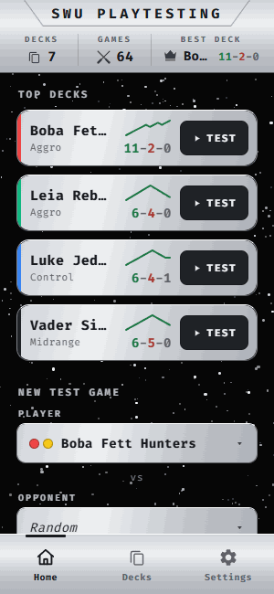</p>

**Portrait**

<table>
  <tr>
    <td align="center">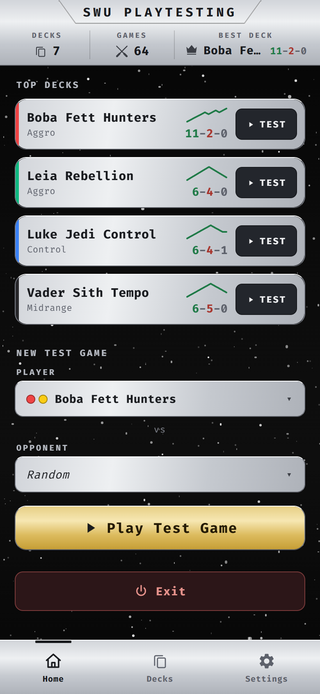<br><sub><b>Home</b></sub></td>
    <td align="center">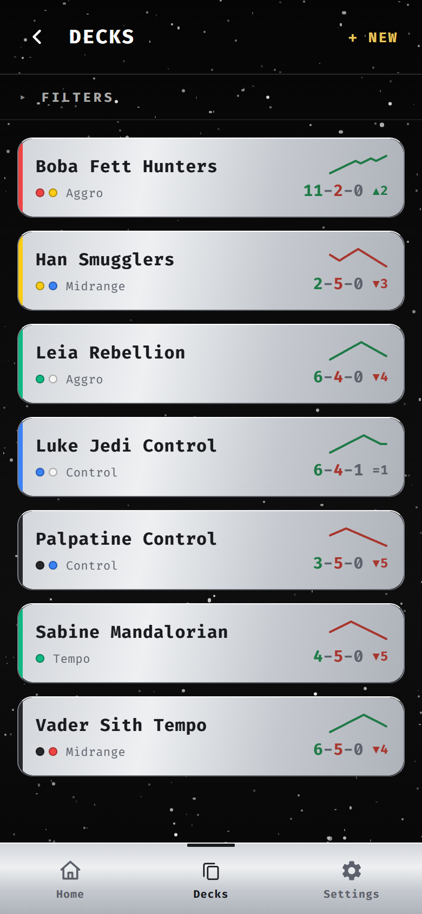<br><sub><b>Decks</b></sub></td>
    <td align="center">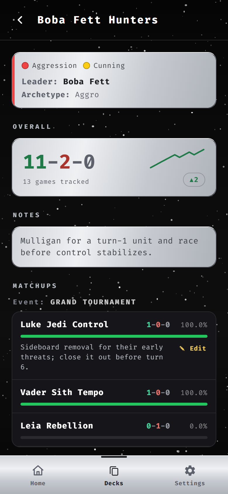<br><sub><b>Deck detail</b></sub></td>
    <td align="center">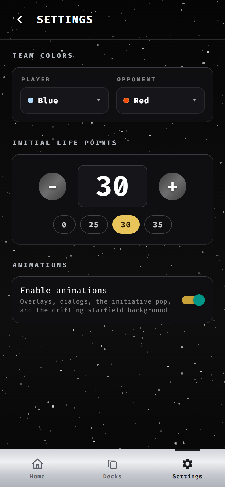<br><sub><b>Settings</b></sub></td>
    <td align="center">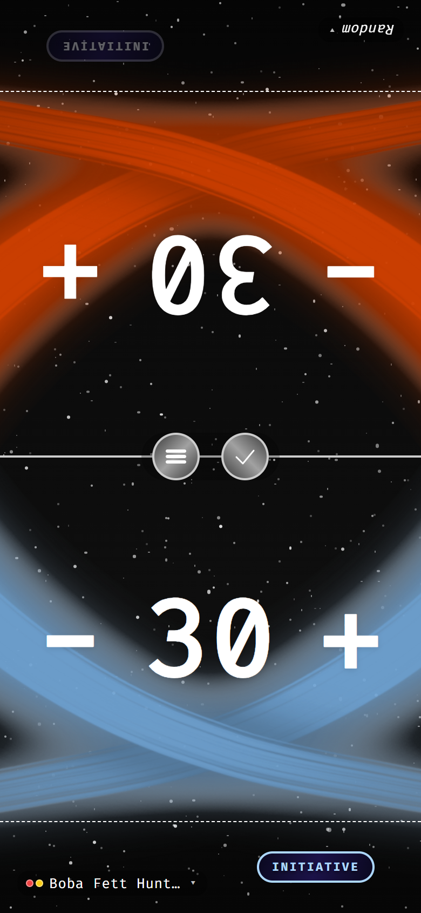<br><sub><b>Life counter</b></sub></td>
  </tr>
</table>

**Landscape**

<table>
  <tr>
    <td align="center">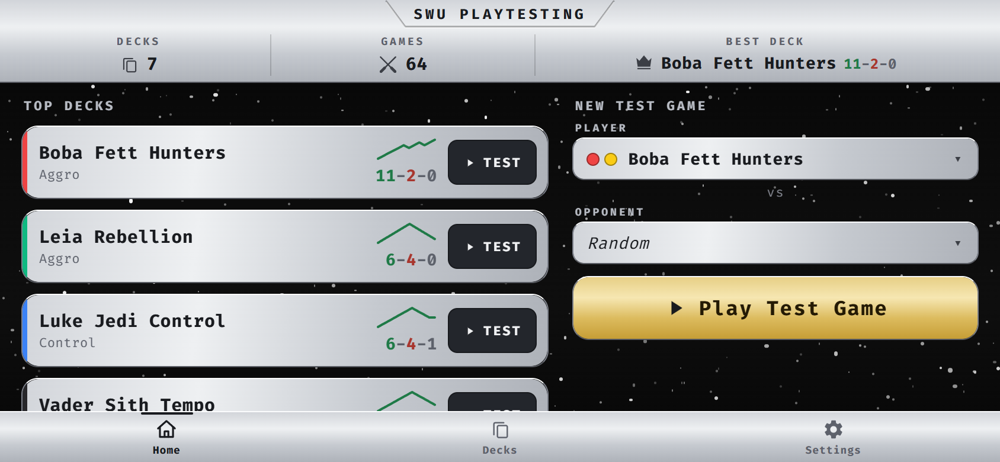<br><sub><b>Home</b></sub></td>
    <td align="center">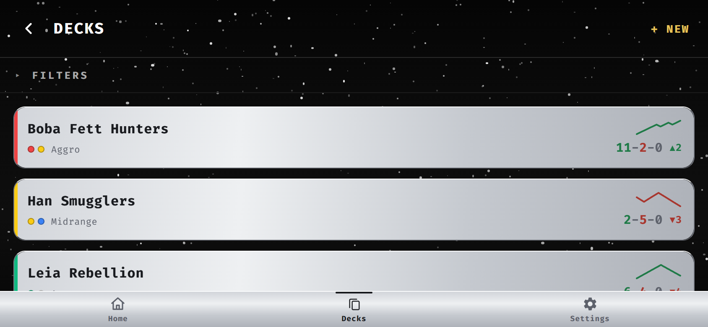<br><sub><b>Decks</b></sub></td>
  </tr>
  <tr>
    <td align="center">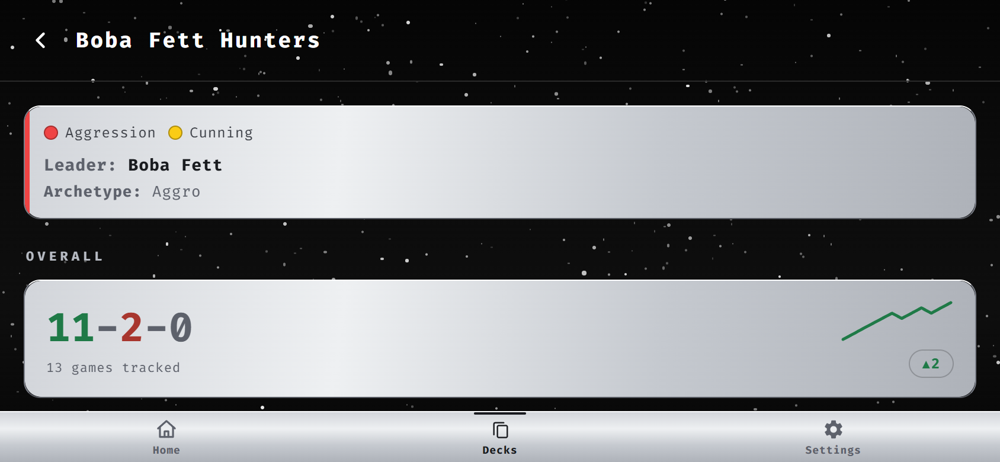<br><sub><b>Deck detail</b></sub></td>
    <td align="center">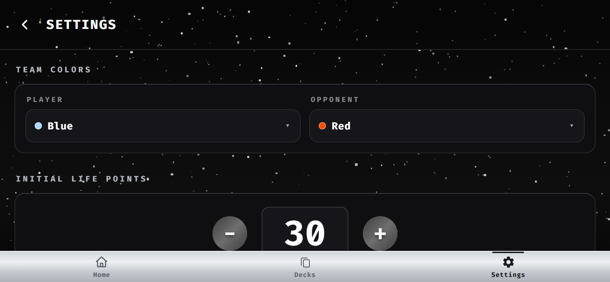<br><sub><b>Settings</b></sub></td>
  </tr>
  <tr>
    <td align="center">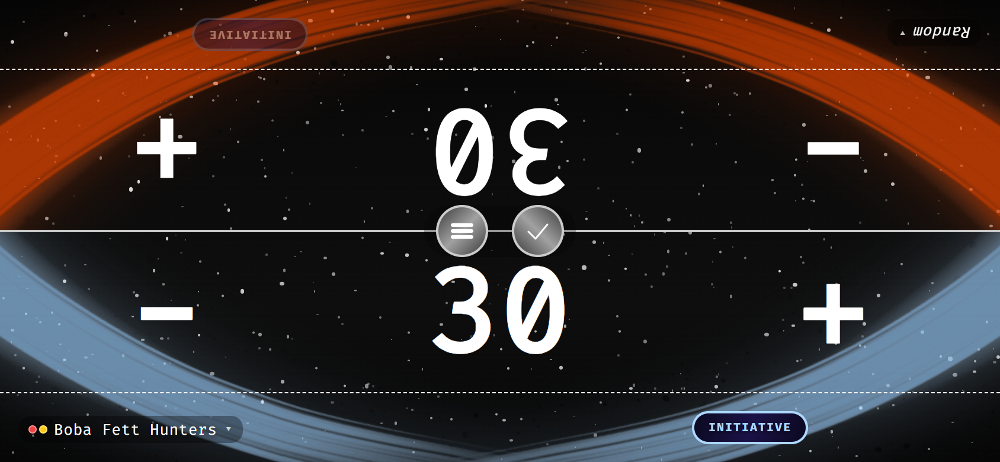<br><sub><b>Life counter</b></sub></td>
    <td></td>
  </tr>
</table>

## Navigation

A persistent **bottom tab bar** — **Home · Decks · Settings** — is always one tap away (a brushed-silver bar with a dark active-tab marker). It hides during a game and in focused edit flows. **Exit** (Android/web only) lives on **Home**, in portrait.

## Home — the dashboard

Home is a compact **metallic dashboard**, not a menu. A top app-bar (linked to the top edge) carries the centered **SWU PLAYTESTING** title — framed by a single engraved line that runs beneath it and turns up diagonally at both ends to reach the top edge — and three centered stats — **Decks**, **Games**, and **Best Deck** (your performance-ranked #1 deck, marked with a crown). Below it:

- **Top decks** — your **top 4** decks as metallic cards: an aspect-colored edge, the name, a **numbers-only record** (`15-5-2`), a recent-form **sparkline**, and a one-tap **TEST**. (Kept short so the Play button stays reachable; the full list is one tap away on the **Decks** tab — no "see all" link needed. No rank numbers, no per-card win %.)
- **New Test Game** — **Player** and **Opponent** each on their own full-width row (every deck shows **all** its aspect dots; **Random** is in italic), then a gold **Play Test Game** button.
- **Exit** (Android/web, portrait only).

There is deliberately **no single "win rate"** — an average across many decks and matchups isn't a meaningful number, so the **ranking** is the signal instead. Empty and large libraries degrade gracefully (a create-first-deck call-to-action; the list simply caps at the top 4 — the full library is one tap away on the **Decks** tab). Portrait and landscape both keep **Play Test Game** reachable.

## Playing a game (the life counter)

Starting a test — **Play Test Game**, or a deck's **Test** — opens the life counter, initialized from your settings (team colors, initial life). Tap **+/−** to change life; values clamp to `[-9, 99]` so cosmic-damage situations stay expressible.

Each side shows its deck in a bottom-left bubble you can **tap to change mid-game**, an **INITIATIVE** control, and a divider with a **hamburger menu** (Return to Home / Reset Life) plus an **end-game** checkmark (enabled while at least one side is a real deck). The checkmark prompts for the outcome — **You won / Opponent won / Draw / Cancel** — and records it. Leaving via **Return to Home** is a deliberate exit: it records nothing.

## Decks & stats

The Decks tab is **one shared list** of decks, sorted alphabetically by default. Each deck has a name (≤ 50 chars), 0–3 aspects (Vigilance, Command, Aggression, Cunning, Heroism, Villainy), an optional leader, an optional **archetype** tag, and free-text notes. Decks render as **metallic cards** with an aspect-colored edge, a **numbers-only record**, a recent-form **sparkline**, and a streak. A collapsible **Filters** panel narrows by name / aspect / archetype and sets the sort (Name or Games played) and order (Asc/Desc). The same deck can be chosen for both sides of a game (a mirror, which counts twice). From a deck's detail screen, two **default checkboxes** (silver = Player, gold = Opponent) pin that deck as the default for each side; tapping a checked box unchecks it and resets that side to Random.

**Stats are symmetric:** one recorded game updates BOTH decks (A beats B ⇒ A gains a win vs B and B gains a loss vs A). A game vs **Random** still counts toward the real deck and shows under a "Random" row in its matchups. Each deck's detail screen shows the deck's **record (numbers only)** + recent form + streak, a **labeled** identity (`Leader: …`, `Archetype: …`), and head-to-head **matchups grouped under labeled event headers** (`Event: PETRANAKI`). Matchups are **display-only** (derived from your games): an existing matchup's strategy notes are shown **read-only** with an explicit **Edit** to change them — there is no per-matchup archetype and no "add" option. **Bulk Add** backfills a season of playtesting in one go (pick a matchup, type W/L/D + an event tag). **Game History** lists every game a deck played, **grouped by opponent** — your record plus each individual game "against deck X" with a W/L/D chip, event, date, and notes — and lets you **add**, **edit**, or **delete** records inline.

Decks, matchups, and game history persist across launches. Deleting a deck cascades its matchups + games and self-heals the loadout. Storage migrates automatically across versions.

## Settings

- **Team Colors** — a dropdown per side (colored dot + name) from an 8-color lightsaber-inspired palette (red, orange, yellow, green, blue, purple, pink, white).
- **Initial Life Points** — default **0**; edit the number directly between `−`/`+`, or tap a quick-pick chip: **0 / 25 / 30 / 35**.
- **Animations** — a single toggle for all animations (overlays, the initiative pop, and the starfield-drift background).
- **Haptic feedback** — for +/− presses (mobile only; hidden on web).

Settings persist across launches.

## Look & feel

A **metallic-on-deep-space** design system: brushed-**silver** surfaces with dark, high-contrast text and a **gold** accent — reserved for the primary **Play Test Game** button and selected states (header icons and the active tab use the neutral dark tone, not gold). It floats over a shared **animated starfield** (neutral near-black, no blue cast, toggleable). Reusable tokens + a `components/ui` kit keep every screen consistent. Custom app icon. Layouts adapt to portrait and landscape.

## Development

```sh
npm install
npm run web        # browser preview (fastest dev loop)
npm run android    # Android emulator/device via Expo
npm run ios        # iOS simulator via Expo
npm test           # node-based unit tests (no install step)
```

## License

**Proprietary — All Rights Reserved.** © 2026 Omar Ferreiro. This is **not** open-source software — see [`LICENSE`](LICENSE). You may view the source, but no permission is granted to use, run, copy, modify, or distribute it without the author's written consent. (An unofficial, fan-made project; not affiliated with, endorsed by, or sponsored by *Star Wars Unlimited* or its owners.)
